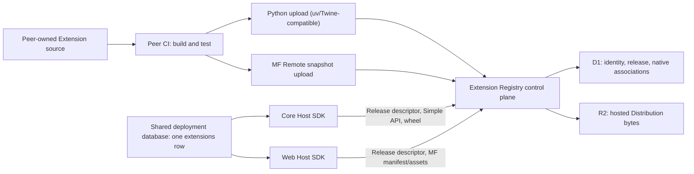

# High-level Technical Design — Native Distribution Cutover

## Status

**Accepted destination; targeted PoCs are in progress.** This document
supersedes the generic target, compatibility-condition, target-manifest,
deployment-binding, embedded-Python-bundle, and shared Runtime/API design.
Product decisions are owned by [`20-decisions.md`](20-decisions.md); executable
PoC evidence is owned by [`work/16-native-distribution-pocs.md`](work/16-native-distribution-pocs.md).

The HLD deliberately uses native package ecosystems instead of rebuilding them
inside InKCre:

- Python: Project/Distribution metadata, wheel tags, `Requires-Python`,
  `Requires-Dist`, entry points, the Simple Repository API, and the legacy
  upload protocol used by existing publishers;
- Web: a native Module Federation `mf-manifest.json`, Remote entry, and the
  complete referenced asset closure;
- InKCre control plane: Extension Name/Nickname, one product Release version,
  publisher authority, release lifecycle, and a typed association plus
  association-local provenance for each native Distribution.

There is no public target key, capabilities digest, generic compatibility
predicate, `artifact_format`, canonical cross-format artifact manifest, or
persisted Distribution binding in the destination design.

## Topology And Authority



Authority is intentionally split:

| Concern | Authority |
| --- | --- |
| Extension Name, Nickname, Release, publisher, lifecycle | Registry control plane |
| Python package compatibility and dependency metadata | wheel/Core Metadata and Simple API |
| Module Federation Remote structure and shared-module metadata | native `mf-manifest.json` |
| Peer/Host SDK compatibility claim | producer-declared typed Registry association |
| Source revision/build provenance | the corresponding native Distribution association |
| Installed exact Release and per-Peer enabled intent | shared deployment `extensions` row |
| Native acquisition, entry validation, lifecycle, runtime cleanup | platform Host SDK |
| Actual running instance | Peer process/browser memory |
| Distribution bytes and internal integrity hashes | Registry R2/storage implementation |

`pip` and the Module Federation Host are **native Distribution Consumers** used
inside their platform Host SDK. They are implementation components, not another
InKCre product authority and not Extension developer tooling.

## Product Identity And Release Descriptor

- **Extension Name** is the canonical namespaced name, for example
  `inkcre/twitter`.
- **Extension Nickname** is human-facing, for example `Twitter`.
- **Extension Release** is `Extension Name + strict SemVer`.
- Every associated native Distribution implements exactly that Release version.
  Stable `X.Y.Z` is identical across formats. Only explicitly mapped,
  lossless SemVer/PEP 440 pre-release spellings are admitted; epoch, post, dev,
  local, and build-metadata versions are excluded from MVP.
- A Python Project name and an MF container/build name are native identifiers,
  not alternative Extension Names and not universal Distribution IDs.

The public exact Release descriptor is the only small cross-format read model:

```json
{
  "name": "inkcre/twitter",
  "nickname": "Twitter",
  "version": "0.1.1",
  "state": "published",
  "python": {
    "project": "inkcre-ext-twitter",
    "simple_url": "/simple/inkcre-ext-twitter/",
    "host_sdk": "core-py",
    "host_sdk_version": ">=0.1.0 <0.2.0",
    "entry_point": {
      "group": "inkcre.core.extensions",
      "name": "twitter",
      "object": "extensions.twitter:Extension"
    }
  },
  "module_federation": {
    "manifest_url": "/extensions/inkcre/twitter/0.1.1/module-federation/mf-manifest.json",
    "host_sdk": "@inkcre/core",
    "host_sdk_version": ">=0.1.0 <0.2.0"
  }
}
```

Each native association is optional. A Release may be published once at least
one association is ready, and a previously absent native format may be appended
later. Consumers—not publishers—decide whether a deployment has every format it
needs. Existing associations and native filenames are immutable; identical
retry is idempotent, conflicting bytes or metadata require a new Release.

Internal content hashes remain mandatory for upload validation, immutable file
addressing, and audit. They are not exposed as a universal Distribution identity
and are not persisted by deployments. Consequently a cold load may resolve a
different still-valid native file for the same immutable Release; InKCre does
not promise a permanent lock to an earlier wheel filename or cached Web byte
copy.

## Registry APIs

### Common control plane

Canonical names occupy two route segments:

- `GET /v1/extensions`
- `GET /v1/extensions/{namespace}/{name}`
- `GET /v1/extensions/{namespace}/{name}/releases/{version}`
- `POST /v1/extensions/{namespace}/{name}/releases` — prepare a Release and
  declare typed native associations;
- `POST .../releases/{version}/publish`
- `POST .../releases/{version}/yank` and `POST .../unyank`.

`preparing` is not visible through public install/Remote routes. Publication
atomically changes the D1-visible Release state after every referenced R2 object
has been validated. `published ↔ yanked` preserves bytes; Python Simple links
carry the native yank reason. An operator-only block may stop reads for an
incident without becoming a package lifecycle state.

### Python-native surface

The Registry implements:

- PEP 503/691 Simple root and normalized Project pages in HTML and JSON;
- PEP 658/714 Core Metadata sidecars;
- SHA-256 file hashes, `Requires-Python`, size, upload time, and yank markers;
- `POST /legacy/` multipart upload compatible with current uv/Twine behavior;
- immutable wheel file URLs under `/packages/...`.

The MVP honestly advertises Simple API `1.1`; it does not claim the later
provenance/project-status fields. HTML/JSON negotiation returns the exact media
type and `Vary: Accept`; the Cloudflare cache must either vary on normalized
Accept or bypass caching for Simple metadata.

Before admission the Registry safely inspects the wheel and verifies:

- normalized Project Name and PEP 440 version;
- version congruence with the parent Extension Release;
- exactly one relevant `.dist-info/METADATA` and `entry_points.txt`;
- the declared entry-point group/name/object;
- safe, non-duplicated archive paths and bounded decompression;
- form metadata and claimed digest against archive truth.

The custom producer table is source/publish input, not runtime authority:

```toml
[tool.inkcre-extension]
name = "inkcre/twitter"
nickname = "Twitter"
host-sdk = "core-py"
host-sdk-version = ">=0.1.0,<0.2.0"

[project.entry-points."inkcre.core.extensions"]
twitter = "extensions.twitter:Extension"
```

The publisher first prepares the typed association, then uv/Twine uploads the
native Project file. Namespace credentials and the unique prepared
Project/version association connect `/legacy/` to the Extension Release.
Project/version/filename plus identical SHA-256 and size is an idempotent retry;
same filename with different bytes is `409`. This stronger retry behavior is an
InKCre policy, not a claim about PyPI's own duplicate-upload behavior.

### Module Federation-native surface

The Registry accepts one multipart archive/directory snapshot for a Release's
MF association and publishes:

```text
/extensions/{namespace}/{name}/{version}/module-federation/mf-manifest.json
/extensions/{namespace}/{name}/{version}/module-federation/{relative-asset}
```

The producer-generated `mf-manifest.json` remains the native public descriptor;
the Registry does not generate another public snapshot schema. The Registry
validates the required shape and proves that the Remote entry plus every
referenced shared/exposed JS/CSS asset is relative, traversal-free, present, and
contained under the immutable Release prefix. `base: './'` is required for the
current Vite producer. At admission it materializes the public native manifest
with `metaData.publicPath` set to that Release's absolute immutable Registry
prefix. This narrow native-field normalization is required because the pinned
MF Host resolves a raw `"./"` public path against the Host page origin rather
than the manifest origin.

Published MF files return `Access-Control-Allow-Origin: *` without credentials,
an ETag, and `Cache-Control: public, max-age=31536000, immutable`. Mutable
control/Simple responses use short or bypassed caching. Public routes always
check a published D1 association before reading R2 so guessed preparing keys
cannot leak.

## Registry Persistence And Publication

D1 uses strict tables with foreign keys:

```text
namespaces(name, status)
credentials(token_hash, namespace, label, disabled)
extensions(name, nickname, publisher metadata)
releases(extension_name, version, state, yank_reason, timestamps)
python_distributions(release, normalized_project, project_version,
                     host_sdk, host_sdk_range, entry_group/name/object)
python_files(project, version, filename, sha256, size, filetype,
             requires_python, core_metadata_sha256, r2_key, uploaded_at)
module_federation_distributions(release, host_sdk, host_sdk_range,
                                manifest_r2_key, internal_snapshot_hash)
```

There is no `targets` table. Upload bytes first enter private staging/content-
addressed R2 keys. After validation, a D1 transaction inserts the immutable
native association and/or flips the Release to `published`. D1 cannot roll back
R2 writes, so validation failures can leave only non-public staging garbage,
removed by a bounded janitor/lifecycle rule.

Python Worker uploads are deliberately bounded to 20 MiB and require
`Content-Length`. Python Workers cannot use Starlette's thread-backed temporary
file spill; the form parser therefore keeps the bounded file in memory and
rejects the request before parsing when its declared length is too large.
Chunked upload receives `411` in MVP. This works with the tested `uv publish`
client and prevents an oversized chunked request from spilling or exhausting an
isolate; direct/multipart R2 upload is a later large-file path.

The public-demo cutover creates a new D1 database and R2 bucket with this schema,
deploys and smokes them, switches Worker bindings, and retains the old resources
only for a short rollback window before deletion. No old target rows, blackbox
release, old Twitter `0.1.0`, credentials, or blobs are migrated.

## Deployment State

All Peers connected to a deployment share one canonical relation:

```text
extensions
  name          text primary key       -- e.g. inkcre/twitter
  version       text not null           -- exact Extension Release
  enabled       uuid[] not null default '{}'
  nickname      text null
  config        jsonb not null default '{}'
  config_schema jsonb null
```

There is no installation/binding split:

- row presence means installed;
- the one row version is the version seen by every Peer;
- membership in `enabled[]` is that Peer's enabled intent;
- running state remains in process/browser memory;
- native Project/manifest, filename, object key, and digest are never stored in
  deployment state.

The Host SDK sees a semantic state port, not SQL/PostgREST/table types. Its Peer
integration implements list/install/uninstall/config/enable operations against
the relation. Install inserts one exact Release with `enabled=[]`. Enable adds a
Peer UUID only after preflight, native acquisition/loading, entry validation,
and lifecycle start succeed. Disable removes it only after lifecycle cleanup.
MVP upgrade/rollback rejects the version write while `enabled[]` is non-empty.
The user explicitly disables Peers, changes the one shared version, then each
Peer re-enables through its own native preflight. This avoids a cross-Peer
orchestrator while keeping version changes fail-closed.

The public-demo hard cut adds a new append-only Core migration that drops only
`extensions`, `extension_installations`, and `extension_peer_bindings`, then
creates the empty canonical relation. It does not edit protected migration
history and does not touch other application tables. Core's catalog/readiness
must stop seeding or requiring first-party Extension rows.

## Platform Host SDKs

The Host SDK is Peer-led and profile-specific. There is no universal lifecycle,
registration model, `ExtensionScope`, or shared Runtime/API package.

### Core Python Host SDK

- `ExtensionBase` is the Extension-facing model and owns validated read-only
  config access; concrete SQLModel rows remain private.
- A wheel entry point yields the `ExtensionBase` subclass.
- Core preserves explicit `on_start` and `on_close`, dynamic route/source/
  resolver publication, rollback, and cleanup.
- Extension code may import arbitrary `app`, `libs`, `utils`, or other Core
  internals. The producer narrows its `core-py` range when those imports are not
  compatible.
- The native consumer checks the Release association against the running
  Core/Host SDK version before requesting bytes, then lets packaging metadata
  and wheel tags perform Python/ABI/platform/dependency selection.
- All six first-party wheels use the PEP 420 `extensions.<id>` namespace so
  existing Source/Resolver identifiers remain stable. The image contains no
  checked-in Extension source, custom target ZIP, or admitted-target catalog.
- Initial acquisition may install into the running Core environment only when
  the installer plan does not replace already-loaded Core-owned distributions.
  Upgrading an already-imported Extension is restart-required; cold restore
  re-acquires the exact Release and preserves enabled intent on failure.

### Web Host SDK

- The MF exposed default module keeps Web's existing
  `initialize → activate → deactivate → dispose` lifecycle.
- The Host reads the exact Release descriptor and checks the producer-declared
  `@inkcre/core` range before asking the MF Host to fetch executable bytes.
- It registers the immutable native manifest URL directly with the MF Host;
  manifest/shared/Remote semantics are not reimplemented by InKCre.
- Extension code continues importing `@inkcre/core` and registering Peer
  contributions directly. The Host SDK does not proxy Core APIs.
- Startup resolves only rows whose `enabled[]` contains the current Peer UUID;
  Registry outage or incompatibility leaves durable enabled intent unchanged
  and reports a runtime error.

## Failure And Operational Semantics

- Unknown/missing native association: the current Peer cannot enable or
  preflight that Release; the Registry never infers a producer-required format.
- Host SDK range mismatch: reject before executable bytes are requested.
- `Requires-Python`, wheel tag, dependency, or MF shared mismatch: native
  consumer failure before Extension lifecycle starts.
- Entry-point/archive or manifest-closure mismatch: Registry admission fails;
  the format is never publicly installable.
- Registry unavailable: existing running instances continue; new install,
  enable, upgrade, and cold restore fail without rewriting installed version,
  config, or enabled intent.
- Yank: normal discovery/selection excludes the Release; exact installed intent
  remains visible, while native consumer behavior follows its yank policy and
  operator block may deny new reads.
- Same-version bytes are never replaced. Repair publishes a new Extension
  Release.

Registry delivery retains protected-main, exact source SHA, frozen dependencies,
same-run checked artifacts, immutable provenance, and read-after-write smoke.
It deletes CI/CD stages whose only purpose was generic target matching,
cross-language Runtime/API publication, canonical target-manifest rebuilding,
embedded Core catalogs, or deployment bindings.

## Targeted PoC Gates Before Implementation

1. **Six native wheels** — build all first-party Extensions as normal wheels,
   preserve `extensions.<id>` imports/Source/Resolver identities, inspect native
   metadata and entry points, install from a local Simple index in Python 3.12,
   and load each entry-point class against Core.
2. **Installer behavior** — prove `pip`/uv exact-version selection,
   `Requires-Python`, wheel tags, dependency-plan conflict handling, identical
   retry, Registry outage, and initial-load versus restart-required upgrade.
3. **Native MF manifest** — generate `mf-manifest.json` with the pinned Vite
   plugin, validate its complete relative asset closure, and load the manifest
   URL with the pinned MF Host/runtime from an arbitrary cross-origin prefix.
4. **Python Worker uploads** — exercise real multipart wheel and MF archives,
   1/20 MiB and oversize/chunked bodies, archive hardening, R2 checksum/staging,
   D1 rollback, and Python Worker memory behavior. If ASGI buffering cannot fit
   the 20 MiB cap safely, route uploads through a native Worker streaming seam
   while keeping the Python control plane.
5. **Destructive rehearsal** — on disposable PostgreSQL, prove the hard-cut
   migration affects exactly three relations, preserves unrelated data, leaves
   zero Extension rows, regenerates the protocol artifact, and reaches ready.
6. **End-to-end native publication** — prepare, upload, publish, anonymous
   Simple/MF reads, idempotent retry/conflict, yank/unyank, CORS/cache behavior,
   and both Host SDK lifecycle journeys without target/binding artifacts.

## Primary Standards

- [Simple Repository API](https://packaging.python.org/en/latest/specifications/simple-repository-api/)
- [PyPI Upload API](https://docs.pypi.org/api/upload/)
- [Core Metadata](https://packaging.python.org/en/latest/specifications/core-metadata/)
- [Entry points](https://packaging.python.org/en/latest/specifications/entry-points/)
- [Wheel format](https://packaging.python.org/en/latest/specifications/binary-distribution-format/)
- [File yanking](https://packaging.python.org/en/latest/specifications/file-yanking/)
- [Module Federation manifest fields](https://module-federation.io/guide/advanced/manifest-fields.html)
- [Module Federation manifest and Snapshot](https://module-federation.io/guide/basic/manifest-snapshot/)
- [Cloudflare Worker limits](https://developers.cloudflare.com/workers/platform/limits/)
- [R2 Worker API](https://developers.cloudflare.com/r2/api/workers/workers-api-reference/)
