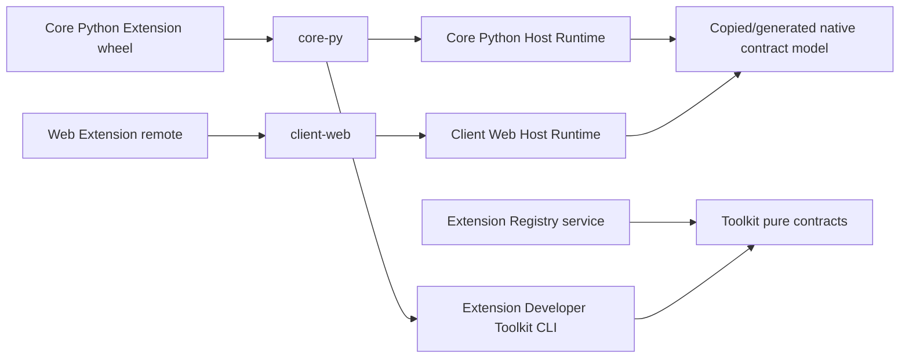

# Extension Host Runtime Family — Readiness Review

> **Superseded:** this review accepted the earlier narrower boundary that kept
> `ExtensionManager` and `ExtensionBase` lifecycle in Core. D043 changed that
> ownership. Its READY verdict is withdrawn pending a revised plan review.

## Review Scope

This review covers the plan in
[Runtime family implementation plan](81-runtime-family-implementation-plan.md),
using the current Core and Client inventories rather than treating either Peer
implementation as the desired package boundary. It checks product authority,
dependency direction, lifecycle ownership, package/release order, executable
file maps and ROI.

## Initial Findings and Resolutions

### 1. Python lifecycle ownership was too broad — resolved

The first draft let the Python Runtime call a Core adapter for
`ExtensionBase` lifecycle/publication. That would either make the Runtime know
Core types or introduce two lifecycle coordinators.

The final boundary is smaller:

- Python Runtime owns Release resolution, local-first Distribution discovery,
  pip acquisition, installed metadata validation and entry-point module
  load/unload;
- Core validates the loaded candidate and exclusively owns `ExtensionBase`,
  config/state, RuntimeClaim, publication, `on_start`/`on_close`, rollback and
  shutdown compensation;
- Python Runtime imports no Core module or adapter protocol.

### 2. Web setup/Vue authority could have leaked into Runtime — resolved

The first draft ambiguously moved setup-contribution types with the Web module.
That would make a native consumer package another authority for the Client Host
SDK.

The final Web Runtime knows only the structural four-hook module and structural
Module Federation consumer port. Client/`@inkcre/core` remains the sole owner of
Vue setup contributions, popup projection, PostgREST state and Peer
coordination.

### 3. Toolkit was becoming a build-system wrapper — resolved

Toolkit does not invoke arbitrary producer build backends. A producer follows
its normal PEP 517 happy path, then gives one existing wheel to Toolkit's single
finalize operation. Toolkit uses the pinned `wheel` unpack/pack path, validates
the result and only then publishes it to the requested output directory.

### 4. Installed presence could have hidden an ambiguous project — resolved

Local discovery first finds the Extension metadata record, derives its
normalized project identity, requires exactly one installed owner of that
project, then validates the complete record and standard metadata. It does not
accept one good record while ignoring a duplicate or malformed owner.

### 5. Active-interpreter mutation behavior was under-specified — resolved

The extraction preserves Core's dependency preflight, prohibition on replacing
Core-owned/loaded distributions and restart-required failure semantics after
pip mutation. Local exact discovery remains read-only and zero-network.

### 6. File and release maps were incomplete — resolved

The implementation plan now names the ext-reg Toolkit/contracts/admission,
both new Runtime packages and package workflow; the Core extraction/adoption
files; and the Client extraction/adoption files. It also states which tests move
and which authority tests remain in each Peer.

The final precision pass also fixes the concrete contract generator and
Registry admission paths, names the initial modules in both Runtime packages,
and freezes the Toolkit finalize command's project/wheel/output inputs.

## Dependency Topology

Runtime packages do not depend on Registry service, Toolkit CLI, Core/Client,
database transports, UI frameworks or concrete Module Federation runtimes.
Registry service does not depend on either Runtime package. The language-neutral
contract is the only shared semantic surface.

## Sequence Closure

1. Toolkit `0.2.0` finalizes wheels with the installed record.
2. Python Runtime `0.1.0` and Web Runtime `0.1.0` build and publish independently.
3. Core locks Toolkit and Python Runtime, rebuilds first-party wheels, then
   deletes its duplicate native consumer.
4. Client locks Web Runtime, migrates only native Registry/MF behavior, then
   deletes its duplicate native consumer.
5. PR previews exercise normal delivery. Core proves both local-hit/no-Registry
   re-enable and fresh-environment Registry fallback.
6. Registry service admission may release/deploy separately; it is not a hidden
   prerequisite for the static preview facade.

There is no package cycle and no requirement for one universal Runtime release.

## Restraint / ROI Review

The plan intentionally adds no:

- database `present` or runtime table;
- universal Python/Web lifecycle abstraction;
- Runtime-to-Peer adapter framework;
- compatibility shim for the rejected historical target/digest package;
- separate support-contract package;
- Toolkit build-backend compatibility layer;
- artifact-wide public reads, byte comparison, cache-busting, digest URL
  substitution or long preview retries.

Verification targets semantic boundaries already responsible for the defect:
installed metadata, zero Registry calls on a local hit, native acquisition on a
miss, package dependency direction, normal repository checks and a short
preview black-box journey.

## Remaining Implementation Risks

These are normal execution risks, not unresolved design questions:

- first-party wheels may expose metadata or ownership assumptions that the
  extracted Python Runtime must preserve exactly;
- active-interpreter pip mutation remains inherently restart-sensitive;
- the concrete locked Module Federation versions must satisfy the structural
  port when Client adopts the packed Web Runtime;
- package release assets and Peer lockfiles must be created in the stated order
  before duplicate code is deleted.

## Verdict

**SUPERSEDED — NOT AN IMPLEMENTATION AUTHORIZATION.**

The ownership, topology, sequence, file/API map, deletion criteria and
acceptance boundary are closed. No additional investigation, exploratory spike
or product decision is required before source work. Source mutation, commits,
package publication, cross-repository changes and preview deployment retain
their existing authorization boundaries.
