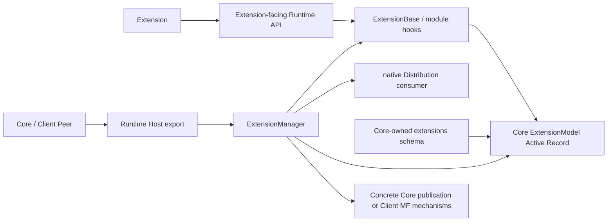

# Host SDK and Host Runtime Alignment

## Definitions

### Extension Host SDK

The Host SDK is a conceptual name for the API surface an Extension sees for one
Host/Peer type. It is not a separate package, release unit or running service.
It contains:

- lifecycle base classes or module hook types;
- typed config/state access;
- contribution types and admitted Peer APIs;
- the Extension-facing errors and context required to implement an Extension.

`ExtensionBase` is therefore an Extension-visible symbol whose implementation
and lifecycle binding are owned by the same Runtime package. Because Extensions
are not developed independently of the Peer implementation, there is no current
reason for a separate SDK artifact or formal `runtime/sdk` export.

Host SDK compatibility remains identified by the Peer API (`core-py` or
`@inkcre/core`) and its version. Runtime package versions are Peer implementation
dependencies and do not silently replace the Extension API compatibility
identity.

### Extension Host Runtime

The Runtime is code used by a Host to execute and manage Extensions. Per Peer
type it owns:

- `ExtensionManager` orchestration;
- `ExtensionBase` implementation/context binding or the equivalent Web module
  lifecycle contract;
- Registry Release/native Distribution consumption;
- local/session Distribution presence discovery;
- native loading and running-instance/resource ownership;
- lifecycle ordering and compensation.

The Runtime knows semantic operations but does not know database tables,
SQLModel/PostgREST, Peer HTTP transport or application UI.

## Corrected Topology

Current Core names an intermediate whole-relation layer `ExtensionStore` and
`SQLExtensionStore`; despite the file name `state.py`, it already handles
install/version/enabled/config/state/config-schema. Historical Core instead
used the SQLModel as an Active Record and `ExtensionManager` worked with model
instances directly. Because this Runtime is explicitly Core-specific and is not
expected to operate without Core, the Repository abstraction is not necessary.

The revised model restores the rich Core-owned `ExtensionModel`. Runtime-owned
`ExtensionManager` consumes its class/instance behavior, and Runtime-owned
`ExtensionBase` binds the active model for config/state access. Core's lower
schema/model module never imports Runtime; Core composition imports Runtime
after those lower layers, so the module graph remains acyclic. There is also no
Contribution Port: a per-Peer Runtime directly integrates with that Peer type's
concrete mechanisms.

## Python Boundary

Python Runtime owns the complete Extension management sequence:

1. query/use the Core-owned `ExtensionModel` Active Record for the
   deployment-installed selection/config/state;
2. discover an exact local wheel before asking for Registry origin;
3. acquire on local miss, then load the standard entry point;
4. create/bind the Runtime-owned `ExtensionBase` context;
5. call lifecycle hooks and Core's existing concrete publication mechanisms;
6. commit enabled/config/state transitions through the bound rich model;
7. compensate lifecycle/resources if a later step fails.

Core owns the SQL schema, rich-model persistence methods,
migrations, transaction/concurrency implementation and HTTP routes. The
Core-specific Runtime may directly use `ExtensionModel` and the existing
FastAPI/Source/Resolver/Peer contribution APIs; Core does not reimplement the
manager state machine.

## Web Boundary

Web Runtime owns the local Web `ExtensionManager`, exact Release/MF consumer,
module lifecycle and compensation. It uses Client's existing rich Extension
model/database API, Registry-origin resolver and concrete Module Federation
instance. Client continues to own
Peer selection/delegation, application UI, popup shell and the Vue setup
projection exposed through `@inkcre/core`.

## Mechanical Contract Drift Prevention

Registry Pydantic models remain the executable source and FastAPI emits OpenAPI
3.1/JSON Schema under `contracts/`. This follows the existing repository happy
path rather than introducing TypeSpec or another schema language.

- `datamodel-code-generator` generates Pydantic v2 models for Python Toolkit and
  Runtime consumers from the checked contract;
- `@hey-api/openapi-ts` generates Web types, the fetch SDK and Zod v4 request,
  response and reusable-definition schemas;
- Registry service uses its source Pydantic models directly.

The repository check performs:

1. regenerate OpenAPI/JSON Schema and all downstream bindings in check mode;
2. fail if `git diff --exit-code` reports stale generated output;
3. type-check every consumer against generated models and prohibit handwritten
   public Release/Distribution duplicates.

This is a compile/repository contract. The generated Zod schemas replace the
current handwritten Registry response schemas rather than adding a second
validator stack. The implementation does not substitute a types-only generator
for the accepted fetch/Zod output. No runtime network check, contract digest,
differential deployment test or new public protocol is introduced.

## Planning Consequence

The earlier implementation plan is not ready because it kept the manager and
`ExtensionBase` lifecycle in Core. The next revision must map:

- Runtime-owned manager/base/context/error modules;
- Core/Client-owned rich Extension model and concrete integration APIs;
- Extension import migrations to the Runtime's public Extension API;
- package compatibility/version declarations;
- duplicate manager/base deletion from Peer repositories;
- fresh static contract-generation checks.

No source implementation should start from the superseded plan.
