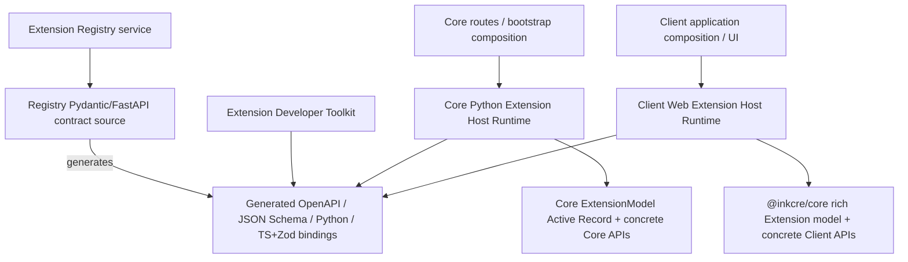
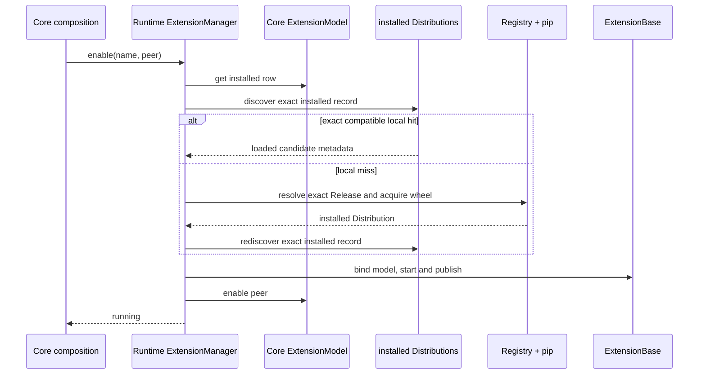
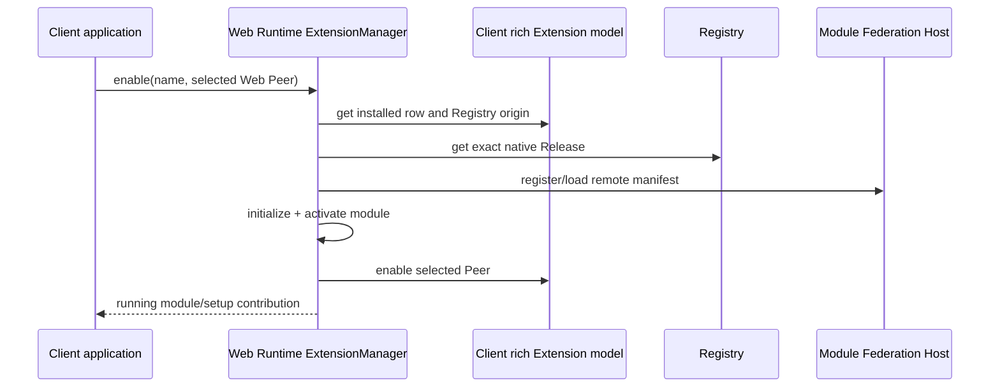

# Impact Handshake — Runtime alignment

- **Status:** accepted architecture rendered for implementation
- **Authority:** D041–D043
- **Supersedes:** ownership and adapter assumptions in plans `79–82`
- **Evidence:** active final findings and current Core/Client inventories

## Intended Outcome

`ext-reg` owns and independently releases the Developer Toolkit plus one
Extension Host Runtime per Peer type. Core and Client consume their Runtime
package instead of embedding duplicate Registry/native-consumer/manager logic.
Core re-enable first discovers an exact compatible installed wheel and therefore
does not require Registry availability on that path.

## Changed Invariants

1. `ExtensionManager` and `ExtensionBase` (or the Web module equivalent) are
   Runtime-owned, not independently implemented in each Peer repository.
2. Core activation is local-first: Registry origin is not resolved until exact
   local Distribution discovery reports a miss.
3. Every Core Extension wheel contains one versioned installed metadata record
   sufficient to prove Extension name/version, Python project/version, Host SDK
   range and entry point without Registry I/O.
4. Release and native Distribution models are generated from one checked
   Registry contract rather than handwritten independently in each unit.

## Preserved Invariants

- `extensions` remains the one deployment installation relation.
- An installed row does not promise every Peer has acquired native bytes.
- `enabled[]` remains durable per-Peer intent; no binding relation returns.
- `present` and `running` remain derived, volatile observations.
- Core owns SQL schema/migrations/ACLs/transactions/concurrency and HTTP routes.
- Client owns Peer selection/delegation, application UI and popup shell.
- Registry owns Release/native association publication and hosted bytes.
- Toolkit owns producer build inspection/finalization/publish/preview workflows.
- Host SDK compatibility identity remains `core-py` or `@inkcre/core`, not the
  Runtime package version.

## Dependency Direction



Except for the explicitly labelled generation edge, arrows point from a
consumer to what it depends on. Core/Client lower model modules do not import
their Runtime. Their application composition imports Runtime only after lower
layers exist, so the deliberate per-Peer coupling creates no module cycle.

For Python, `app.*` is a **host-provided import contract**, analogous to the Web
package's npm peer dependency. `core-py` is an executable host and is not a
published dependency of the Runtime wheel. Therefore package metadata contains
only `core-py -> Runtime`; Runtime source may import lower Host modules that are
already present in that executable. The lower modules never import Runtime,
which keeps the runtime module graph acyclic. The package is not promised to
execute outside a compatible Core source/runtime tree.

## Authority Matrix

| Concern | Authority | Runtime interaction |
| --- | --- | --- |
| Release/native association | Registry contract/service | consumes generated binding |
| installed wheel record | Registry contract; Toolkit writes/inspects | Python Runtime discovers/validates |
| `extensions` row | Core rich `ExtensionModel` | manager/base call model behavior directly |
| SQL transaction/concurrency | Core model/database | never reimplemented in Runtime |
| config/state | bound rich model | `ExtensionBase` exposes typed behavior over the model |
| FastAPI/Source/Resolver/Peer contribution | concrete Core APIs | Core Runtime uses them directly |
| MF Host/module lifecycle | concrete Client/MF APIs | Web Runtime uses them directly |
| selected Peer/delegation | Client application | outside Web Runtime |
| setup popup/UI | Client and Extension Web target | outside Runtime management UI |

## Active Record Boundary

Core's existing `ExtensionModel` becomes the rich aggregate again. It owns
install/get/list/uninstall, exact version mutation, per-Peer enabled mutation,
config, state and config-schema behavior. Runtime owns no Store/Repository and
executes no SQL directly. `ExtensionBase` holds the active model instance and
delegates config/state methods to it; this preserves the established Active
Record/充血模型 without making a code class inherit the SQL row type.

The equivalent Client rich model remains in `@inkcre/core`; the Web Runtime
uses that concrete API. No cross-Peer Active Record interface is invented.

## Contract Drift Gate

The canonical source is the Registry-owned Pydantic model used by FastAPI.
Generation is one-way:

```text
Pydantic/FastAPI
  -> OpenAPI 3.1 + JSON Schema
  -> datamodel-code-generator -> Toolkit/Python Runtime Pydantic bindings
  -> @hey-api/openapi-ts      -> Web fetch/types/Zod v4 bindings
```

Checks regenerate into deterministic checked files and fail when the working
tree differs. Generated files are consumed by package builds/type checks. There
is no contract digest, network differential test, second schema language or
handwritten parallel Release/Zod model.

## Lifecycle Sequences

### Core enable / cold restore



If lifecycle succeeds but enabled persistence fails, the manager compensates
the lifecycle. A local exact hit performs no Registry-origin lookup, HTTP or
pip work.

### Web enable



Web `present` is session-local and does not reuse Python's durable-wheel rule.

## Compatibility and Migration Effects

- New Runtime packages have their own versions, but Extension compatibility is
  still checked against the Peer Host SDK identity/version.
- Python Runtime publication includes a compatible Core consumer integration
  check; Web Runtime publication includes a compatible `@inkcre/core` peer
  consumer check. Standalone Runtime execution is not a supported condition.
- First-party Python wheels are rebuilt with installed metadata; old wheels
  without the record are a local miss and are not guessed from package names.
- Core and Client delete embedded duplicate managers/consumers only after the
  released Runtime is locked and adopted.
- No migration changes the `extensions` relation for this batch.
- No compatibility shim revives the historical target/digest Runtime API.

## Verification Impact

Add only boundary evidence proportional to the defect:

- generated-contract clean-diff checks;
- wheel finalize/inspect and installed-record discovery;
- local hit makes zero Registry calls;
- local miss follows Registry/Simple/pip;
- manager lifecycle/persistence compensation using the concrete rich model;
- normal package/repository checks;
- short preview journeys, not exhaustive public artifact verification.

## Rollback/Deletion Boundary

Package adoption is reversible by restoring the Peer lockfile and embedded
implementation until duplicate deletion lands. Database rows and migrations do
not change. Published package assets are immutable and are not deleted as a
rollback mechanism. Duplicate Peer code is removed only after same-repository
tests pass against the locked package.
