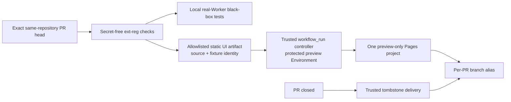

# Evidence-form And Free-tier Investigation — 2026-08-12

## Recommendation

Use one fixed, preview-only Cloudflare Pages **Direct Upload** project for the
read-only Extension-list UI. Give each eligible same-repository PR a Pages branch
alias such as `preview/ext-reg/pr-123`; do not create a Worker, database, bucket,
Pages project, or custom domain for that PR.

This preserves a clickable browser Preview while moving the expensive Registry
behavior back to secret-free automated black-box tests.

## Product-fit Evidence

- The current catalog UI is generated by one pure Python function and contains
  no JavaScript or external runtime dependency.
- A three-Extension populated document is 3,720 UTF-8 bytes and compresses to a
  1,598-byte ZIP in a bounded local experiment.
- The accepted human decision is visual/content review of this page; links to
  Registry APIs, API availability, publication, installation, and runtime are
  outside the Preview promise.
- The selected Preview artifact contains only one bounded regular `index.html`.
  The trusted controller generates the machine-readable identity and headers.
  This deliberately avoids both executable Pages Functions and a custom
  HTML/CSS policy parser.

## GitHub Evidence

- `InKCre/ext-reg` is public. GitHub documents standard hosted-runner use as free
  for public repositories.
- GitHub Free for organizations includes 500 MB of pooled Actions artifact and
  Packages storage. Public-repository artifacts can be retained for 1–90 days;
  downloading requires a signed-in reader.
- Live August organization billing reports 1,899 Linux runner minutes and
  164.497 GB-hours of Actions storage, both fully discounted to net zero.
- The repository currently retains one 232,317-byte artifact. Adding a roughly
  1.6 KB compressed UI document with one-day handoff retention is negligible,
  but still consumes shared artifact storage and therefore remains bounded.
- Eighteen distinct pull-request check runs occurred between 2026-08-09
  18:07 UTC and 2026-08-11 10:11 UTC. This is a short bootstrap burst, not a
  reliable monthly forecast, but it is enough evidence not to ignore a
  provider-wide build queue.

Official sources:

- [GitHub Actions billing and included storage](https://docs.github.com/en/billing/concepts/product-billing/github-actions)
- [Artifact retention for public repositories](https://docs.github.com/en/organizations/managing-organization-settings/configuring-the-retention-period-for-github-actions-artifacts-and-logs-in-your-organization)
- [Artifact reader requirements](https://docs.github.com/en/actions/how-tos/manage-workflow-runs/download-workflow-artifacts)
- [Secure handling of untrusted PR code and artifacts](https://docs.github.com/en/actions/reference/security/securely-using-pull_request_target)

## Cloudflare Pages Evidence

- Pages Free permits 100 projects per account. The live account currently has
  six, so the recommended fixed project would use slot 7 of 100.
- Pages Free documents unlimited active preview deployments, 20,000 files per
  site, and 25 MiB per file. The proposed site has one roughly 3.7 KB document.
- Git-integrated Pages builds are limited to 500 per month and one concurrent
  build across the account. Only one of the six live projects is Git-integrated;
  the existing InKCre client and website projects use Direct Upload.
- Direct Upload accepts prebuilt assets. Therefore the candidate build remains
  in GitHub's secret-free check and Pages only receives checked static data. It
  still creates a Pages deployment, but does not need a Cloudflare build of the
  repository. This build-queue conclusion is an inference from Cloudflare's
  separation of Git builds and Direct Upload and must be confirmed in the first
  bounded implementation smoke.
- Pages assigns immutable deployment URLs and mutable branch aliases. Old
  deployments can be deleted, but the latest deployment for a branch cannot;
  closure must therefore replace the alias with a trusted tombstone and retain
  that tombstone as a policy-owned record.
- Cloudflare's Pages Write permission is account-scoped and can create, edit,
  and delete Pages projects. A dedicated Pages-only token is materially narrower
  than the Registry production credential but cannot be restricted to one Pages
  project. This is the principal residual authority.

Official sources:

- [Cloudflare Pages Free limits](https://developers.cloudflare.com/pages/platform/limits/)
- [Direct Upload of prebuilt assets](https://developers.cloudflare.com/pages/get-started/direct-upload/)
- [Preview URL and deletion semantics](https://developers.cloudflare.com/pages/configuration/preview-deployments/)
- [Pages API deployment cleanup](https://developers.cloudflare.com/pages/configuration/api/)
- [Cloudflare account-scoped API permissions](https://developers.cloudflare.com/fundamentals/api/reference/permissions/)

## Why Direct Upload Ranks First

### Compared with Pages Git integration

Git integration gives same-repository PR URLs without exposing an API token and
is a valid fallback design. It is not preferred because:

- candidate code is built a second time outside the admitted GitHub check;
- it consumes the account-wide 500-build/one-concurrent queue;
- it does not wait for the repository's required check;
- closing a branch does not by itself prove retirement of its latest deployment.

### Compared with Actions artifacts

Artifacts have the smallest authority and automatic expiry, but the reviewer
must sign in, download a ZIP, extract it, and open a local file. Keep this as the
fallback when the Pages credential or retained tombstone is judged too broad.

### Compared with GitHub Pages

GitHub Pages is free for this public repository, but supplies one site per
repository rather than native per-PR aliases. Serving several PRs would require
a shared path aggregator, write authority, and cross-PR concurrency/cleanup
protocol. That is more implementation complexity than the UI warrants.

## Proposed Bounded Topology

1. The ordinary `pull_request` check builds and validates the exact candidate
   static UI with deterministic fixture data and no secret.
2. It uploads only the bounded `index.html` with one-day handoff retention.
3. A protected-main `workflow_run` verifies workflow name/path, success,
   same-repository origin, open PR targeting `main`, and exact current head.
4. The controller accepts only that regular file within the size bound, never
   executes it, and generates trusted identity/header files itself. It does not
   parse HTML or CSS.
5. A protected `preview` Environment supplies a dedicated Pages-only token. The
   controller uploads to one fixed Pages project and deterministic PR branch.
6. It verifies the immutable deployment and branch alias, controller-generated
   source identity, noindex, and CSP. The Environment job is the audit record;
   no duplicate GitHub Deployment lifecycle is created.
7. Closing the PR uses trusted code to deploy a tombstone to the same alias and
   delete older exact-branch deployments when Cloudflare permits it.
8. Fork PRs stop after secret-free checks and artifacts.

## Cost Bound

- Fixed Cloudflare resource: one Pages project, moving live account use from
  6/100 to 7/100.
- Per-PR Cloudflare data plane: none; no Worker, Function, D1, R2, KV, custom
  domain, or runtime binding.
- Per-update GitHub handoff: approximately 1.6 KB before Actions metadata, with
  one-day retention proposed.
- Runner price: net zero for standard runners in this public repository under
  current GitHub terms and verified current billing.
- Retained Pages state: immutable deployment history plus exactly one latest
  deployment per branch; active candidate content is replaced by a tombstone on
  closure.

## Accepted Selection

Sir accepted the fixed Pages project, browser URL, Pages-only account-scoped
credential, and retained tombstone trade-off. The short-retention GitHub
artifact remains the explicit fallback if implementation evidence disproves the
free-tier, authority, or lifecycle assumptions.

This selection closes the option investigation but is not an implementation
plan or start gate. Batch 3 must still produce the HLD, and Batch 4 must produce
and review the complete execution specification before implementation can be
authorized.
