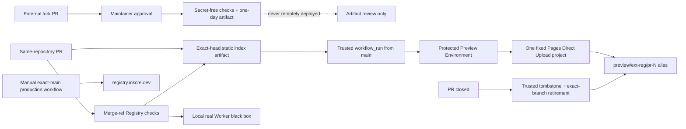

# Simplified Governance And Static Preview HLD

## Scope

This design aligns `InKCre/ext-reg` with the organization Git/GitHub baseline
and gives maintainers a browser URL for the read-only Extension-list UI. It does
not create a Preview Registry service or data plane.

The production Registry remains the Python Worker at
`https://registry.inkcre.dev`. Registry APIs, Python Simple, Module Federation,
publisher behavior, and Peer integration remain local real-Worker black-box
responsibilities.

## Governing Trust Decision

`InKCre/.github/GOVERNANCE.md` already owns the untrusted-contributor rule:

- every external fork contributor requires maintainer approval before even
  secret-free Actions may start;
- approval grants no Preview or production credential;
- fork pull requests receive no remote Preview delivery;
- a same-repository Preview uses a trusted controller, exact head identity, and
  a Preview-scoped Environment.

Live ext-reg drift is `approval_policy=first_time_contributors`; rollout changes
it to `all_external_contributors`.

The design does not add an HTML/CSS parser on top of that policy. A
same-repository branch can only be created by a collaborator with repository
write access. The isolated static document is review evidence from that trusted
contributor; merge and production authority remain separately protected.

## Topology

## Candidate Artifact

The candidate job renders the production catalog function with the deterministic
`tests/fixtures/ui-preview.json` review fixture. The artifact contains exactly
one regular file:

- `index.html`, at most 64 KiB.

The builder validates fixture entries with `ExtensionSummary`, renders preview
links against `https://registry.inkcre.dev`, and adds the existing noindex option
to the document. Unit tests own escaping, catalog content, empty state, and
origin handling.

The artifact contains no credential, Registry data snapshot, Worker, Functions
tree, header policy, source manifest, or deployment command. It is retained for
one day.

## Trusted Controller

The `workflow_run` controller is selected from protected `main`. Before entering
the Preview Environment it verifies:

- workflow name and path;
- `pull_request` event and successful conclusion;
- same repository, one open PR targeting `main`, and exact current head SHA;
- one unexpired artifact whose name contains that exact head SHA.

It downloads the artifact into a new temporary directory and accepts only one
non-executable regular file named `index.html` whose size is within 64 KiB. It
does not parse, sanitize, or allowlist the HTML or CSS.

The controller creates a fresh deploy directory containing:

- the candidate `index.html`;
- trusted `preview.json` with schema version, PR number, and exact source SHA;
- trusted `_headers` with noindex, no-store, nosniff, no-referrer, and
  `Content-Security-Policy: default-src 'none'; style-src 'unsafe-inline';
  base-uri 'none'; form-action 'none'; frame-ancestors 'none'`.

Only this directory is uploaded to the fixed Direct Upload project
`inkcre-extension-registry-ui-preview`, branch `preview/ext-reg/pr-<number>`,
with commit hash equal to the exact PR head. Smoke verifies the immutable URL
and branch alias, `preview.json`, HTML content type, noindex, and CSP.

Every same-repository PR follows this path. There is no changed-file classifier.

## Cleanup

`pull_request_target: closed` and a guarded manual dispatch run only trusted
default-branch cleanup. The workflow never checks out candidate code and shares
the same `pages-preview-ext-reg-<number>` concurrency group as delivery.

Cleanup:

1. verifies a closed same-repository PR targeting `main`;
2. deploys a checked-in trusted tombstone to the deterministic Pages branch;
3. verifies the branch alias serves the tombstone;
4. lists deployments only for the fixed project and exact branch;
5. deletes older exact-branch deployments while retaining the latest tombstone.

The fixed `preview` Environment supplies GitHub's deployment audit record.
There is no second custom GitHub Deployment lifecycle. One-day Actions artifacts
expire normally and are not manually deleted.

Cloudflare cannot delete the latest branch alias deployment; the trusted
tombstone is therefore the explicit retained policy record.

## Authorities

### Candidate

- default workflow token read-only;
- no Cloudflare or publisher credential;
- frozen repository checks and local Worker black box;
- may upload only the bounded static artifact.

### Preview controller

- protected-main workflow code;
- `preview` Environment restricted to protected branches;
- dedicated account-scoped Pages Write token;
- exact fixed project and deterministic branch only;
- no Worker, D1, R2, publisher, custom-domain, or production authority.

### Production

- manual exact-current-main workflow;
- `production` Environment restricted to protected branches;
- dedicated Worker/D1/R2 token;
- no Preview project authority is needed.

Cloudflare offers Pages Write at account rather than project scope. The trusted
controller's fixed project/branch command and dedicated token are compensating
controls; the residual is recorded rather than hidden.

## GitHub And Organization Alignment

- Add `ext-reg` to `InKCre/.github` enforcement scope and repository profile.
- Disable merge commits; keep squash/rebase and current stacked-branch policy.
- Set default workflow permission to read and disallow Actions PR approval.
- Set fork contributor approval to `all_external_contributors`.
- Keep required checks strict, App-bound, and conversation resolution enabled.
- Add protected `preview` and correct `production` Environments.
- Rename public contexts to `ext-reg checks`, `ext-reg preview`,
  `ext-reg preview cleanup`, and `ext-reg deployment` when the substantive
  workflow migration lands.

## Failure And Fallback

- Failed/cancelled checks, a moved head, closed PR, fork, ambiguous PR, missing
  artifact, or identity mismatch prevents Preview mutation.
- Preview delivery never falls through to production or another project.
- Delivery and cleanup share a concurrency key; stale delivery is cancellable,
  cleanup is not.
- The first introducing PR cannot exercise the new default-branch
  `workflow_run`; a bounded same-repository canary after merge is mandatory.
- The canary explicitly proves the protected Preview Environment accepts the
  controller's default-branch ref. If not, remote Preview is disabled and the
  one-day artifact remains the accepted fallback.
- If Direct Upload unexpectedly consumes paid/build quota or the token/project
  boundary is unacceptable, disable remote delivery. Do not invent another
  remote topology.

## Cost And Retention

- Persistent state: one fixed Pages project and one latest tombstone per closed
  same-repository PR branch.
- Per PR update: one document-sized one-day Actions artifact and, for internal
  PRs, one Direct Upload deployment.
- No per-PR Worker, D1, R2, Pages project, custom domain, or Functions resource.
- Canary acceptance records actual Pages project/deployment/build usage; the
  artifact-only fallback is automatic if the free assumption is disproved.

## Explicit Non-goals

- No interactive candidate Registry API or publisher flow.
- No candidate database, object store, Worker, or runtime integration.
- No Preview custom domain.
- No fork remote Preview.
- No custom HTML/CSS sanitizer or browser grammar.
- No UI-path classifier.
- No duplicate explicit GitHub Deployment lifecycle.
- No manual deletion of one-day Actions artifacts.
